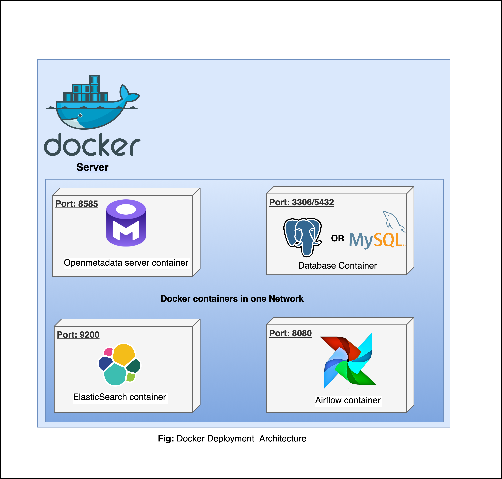

# Deploy openmetadata with docker compose

You can find the official docs [here](https://docs.open-metadata.org/v1.4.x/deployment/docker).

We suppose you already have the `docker(version 20.10.0 or higher) and docker compose(version 2.2.3 or higher)` on 
your server. You can use the below command to check

```shell
docker --version
docker compose version
```

## 1. Architecture overview 

The docker compose spec of the openmetadata(OM) will create four containers:
- OM web app : requires 2vcore and 6GiB
- database(postgres or mysql) : 2 vcore and 4GiB memory and 100GiB storage volume
- elasticsearch: 2 vcore and 4GiB memory and 30GiB storage volume
- ingestion server(airflow, OM python packages): 2 vcore and 4GiB memory and 10GiB storage volume

Below figures shows which port the services will be exposed



> To run the docker compose, we recommend you to have a server(vm) which has `8vcore, 20GiB memory and 200GiB` for 
> minimum running.

## 2. Deployment steps

### 2.1 Get the docker compose file

You can download the `Docker Compose files` from the [Releases](https://github.com/open-metadata/OpenMetadata/releases/).

Currently,(20/06/2024), you should find four docker compose file in the release assets:
- **docker-compose-openmetadata.yml**: contains only two docker compose services: `openMetadata-server` and `execute-migrate-all`
- **docker-compose-ingestion.yml**: contains only one compose service: `ingestion`
- **docker-compose.yml**: contains five services: `mysql`, `elasticsearch`,`ingestion`,`openMetadata-server` and `execute-migrate-all`
- **docker-compose-postgres.yml**: contains five services: `postgres`, `elasticsearch`,`ingestion`,`openMetadata-server` and `execute-migrate-all`

> We recommend you to use **docker-compose-postgres**, because postgres has fewer issues than mysql

You can also run the below command to fetch the docker compose file directly from the terminal

```shell
# get the OM 1.4.1 
wget wget https://github.com/open-metadata/OpenMetadata/releases/download/1.4.1-release/docker-compose-postgres.yml
```


## run the docker compose with custom env var

```shell
sudo docker compose -f docker-compose-postgres.yml --env-file jwt.env up -d
```

## ingest data