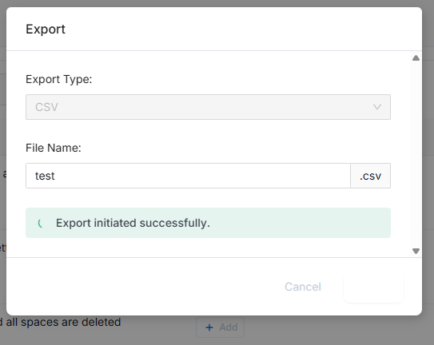

# Export data asset

You can find the [official doc](https://docs.open-metadata.org/latest/how-to-guides/data-discovery/export) for 
exporting data asset.


## 1. Export via web interface

> I tried the web interface, the export does not work.
> 

The export dialog freeze as shown in the below figure.




## 2. Export via rest API

In the doc, I only get examples of database like assets export:
- Database service
- Database
- Schema
- Tables

> I'm not sure if we can export other data assets metadata


The below list shows the four endpoints for export database assets

```bash
# You can also export the Database Service using the API with the following endpoint:
# Make sure to replace {name} with the Fully Qualified Name (FQN) of the Database Service.
/api/v1/services/databaseServices/name/{name}/export 

# You can also export the Database using the API with the following endpoint:
# Make sure to replace {name} with the Fully Qualified Name (FQN) of the Database.
/api/v1/databases/name/{name}/export 

# You can also export the Database Schema using the API with the following endpoint:
# Make sure to replace {name} with the Fully Qualified Name (FQN) of the Database Schema.
/api/v1/databaseSchemas/name/{name}/export 

# You can also export the Tables using the API with the following endpoint:
# Make sure to replace {name} with the Fully Qualified Name (FQN) of the Table.
/api/v1/tables/name/{name}/export 
```

### 2.1 Export database service

```bash
export om_oidc_token="your_jwt_here"

curl -X GET "https://om-dev.casd.local/api/v1/services/databaseServices/name/Constances-Geography/export" \
  -H "Authorization: Bearer $om_oidc_token" \
  -o exported_db_service.json
  
curl -X GET "https://om-dev.casd.local/api/v1/databases/name/Constances-Geography.hospitals_in_france/export" \
  -H "Authorization: Bearer $om_oidc_token" \
  -o exported_db.json
  
curl -X GET "https://om-dev.casd.local/api/v1/databaseSchemas/name/Constances-Geography.hospitals_in_france.Geography/export" \
  -H "Authorization: Bearer $om_oidc_token" \
  -o exported_db_schema.json

curl -X GET "https://om-dev.casd.local/api/v1/tables/name/Constances-Geography.hospitals_in_france.Geography.fr_communes_raw/export" \
  -H "Authorization: Bearer $om_oidc_token" \
  -o exported_table.json

```